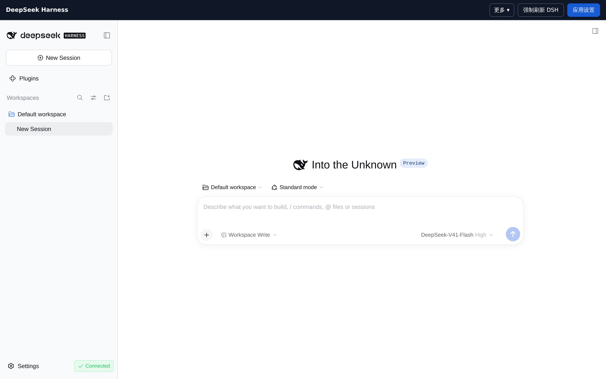

# DeepSeek Harness for fnOS

将 DeepSeek 官方 **dsh Web UI** 打包为飞牛 fnOS 的 FPK 应用。当前目标为 fnOS x86_64。FPK 随包携带 `@deepseek-ai/dsh@0.2.0-rc.2` 作为首次安装及离线兜底核心；后续 dsh 核心可独立安装到应用私有数据目录，FPK 管理入口保持不变。

## 界面预览

桌面端（窗口取自 NAS 的 IPv4 入口，顶部为应用自己的导航栏）：



## 下载与安装

安装包发布在 [Releases](https://github.com/upcyan/PowerHarness/releases) 页面，每个版本附一个 `dsh-fnos-<版本>.fpk`。**请选标有 Latest 的最新版本**；release 正文里有该版本的 SHA-256，下载后核对：

```sh
# 把 <版本> 换成实际版本号，哈希以该 release 正文为准
sha256sum dsh-fnos-<版本>.fpk
```

> 请使用 [0.3.86](https://github.com/upcyan/PowerHarness/releases/tag/v0.3.86) 或更新版本。旧版 `0.3.84`、`0.3.85` 的 MCP 依赖存在已知 OAuth 凭据校验漏洞，不建议安装。

安装步骤：

1. 从 Releases 下载 `dsh-fnos-<版本>.fpk` 到本机，并用上面的命令核对哈希。
2. 打开 fnOS **应用中心**，通过「手动安装」选择该 `.fpk`（部分版本在应用中心右上角的设置里提供该入口）。
3. 安装完成后点击桌面上的 **DeepSeek Harness** 图标启动，再按下一节「打开方式」完成首次进入。
4. **首次启动会初始化数据目录并可能重启一次核心**，属正常现象；页面在此期间显示「自动维护模式，请等待」。

升级注意事项：

- **版本号必须递增**，fnOS 才会识别为更新；同版本重装可能被拒绝。
- 应用会保留应用私有数据目录中的配置、会话与插件。**升级前建议先在应用设置的「备份与恢复」里做一次手动备份**，尤其是装过第三方插件或改过 `cordis.patch.yml` 之后。
- 升级过程会短暂停止 DSH 核心；正在进行中的对话或任务会中断。
- 若新核心启动失败，应用会回到上一版可用核心并给出「待确认横幅」，由你决定是否恢复数据，不会自动覆盖。
- 回退到旧版本：下载旧版 `.fpk` 重新安装即可，但**低版本号可能被 fnOS 拒绝**，这种情况需先卸载（会清除应用数据）或等待修复版本。

> ⚠️ 本应用会以应用专用用户在 NAS 上执行 DSH 的文件与命令操作，并提供一个仅限 fnOS 管理员访问的 Web 入口。**只从本仓库的 Releases 下载**，不要使用来源不明的 FPK。

## 打开方式

安装并启动后，点击 fnOS 桌面的 DeepSeek Harness 图标。电脑通过 NAS IPv4 登录时使用应用的 `https://NAS_IP:3080` 入口；手机飞牛 App 和主机名入口将 DSH 页面、静态资源、HTTP API 与 WebSocket 通过 fnOS 已认证的应用路径 `/app/dsh-fnos/dsh/` 转发，因此不再要求手机直连 NAS 局域网地址或独立端口。窗口顶部有独立的 **应用设置** 按钮；窗口主体显示完整 dsh Web UI。在 DSH 页面，顶部按钮为 **强制刷新 DSH**；点击后需确认，确认后会以一次性 URL 重新加载 DSH 页面，未保存的输入可能丢失，但不会重启 DSH 核心。进入应用设置后按钮显示 **返回 DSH**，可直接返回。应用设置管理 FPK 的核心更新、备份和安全模式，dsh 自带的 Settings 仍用于模型等 dsh 配置。两种入口都使用一次性进入凭据。局域网独立 HTTPS 入口第一次打开时仍需接受应用生成的本机证书；由于桌面图标的引导页把它嵌在 iframe 里，而浏览器不允许在 iframe 内放行证书，**全新 NAS 或全新浏览器首次经桌面图标进入会看到空白**。直连入口的引导页会旁路探测该端口的可达性（`/_fnos/reachability.svg`，免凭据），探测失败即把空白帧替换为指引面板：先在新标签页打开应用地址完成证书信任（高级 → 继续前往），再回来点 **重新检查**（重新签发一次性凭据）；面板同时提示检查局域网连通性与防火墙端口。探测成功时不干预已挂载的 iframe —— 进入凭据是一次性的，重新挂载会让第二次请求直接 403。随后在 **Settings → Models** 设置 DeepSeek API Key，并选择工作区。fnOS 点对点、公网和 FN Connect 的最终可用性需要在对应的真实连接方式下验证，尤其是 WebSocket 和文件上传。

Web UI 的命令和文件操作在 NAS 上以应用专用用户身份执行。初始工作区位于应用私有数据目录。要访问其他 NAS 文件夹，请到 fnOS 应用中心找到 DeepSeek Harness，在访问权限中授权目录并重新启动应用。应用设置的 **数据与权限 → 目录权限** 显示授权根目录的基础权限；可读取的目录会在工作区的 **fnOS 授权目录** 中出现快捷入口。快捷入口不会把外部目录内容复制进应用备份，访问仍受 fnOS 目录权限控制。子目录可能有单独的 ACL；如果选择 DSH 工作区时遇到 `EACCES`，在目录权限页输入完整工作区路径，点 **检测实际写入权限**。检测会创建并立即删除一个临时空目录，以确认该位置能否用于 DSH 工作区。若写入被拒绝，需要在 fnOS 中为应用授予目标目录读写权限并检查该子目录的 ACL。

**数据与权限 → 容器权限** 可检查应用用户的 Rootless Docker 安装条件及专属 Socket。NAS 管理员完成 Rootless 守护进程安装并使其运行后，设置页会验证 Socket 归属和守护进程的 Rootless 标志，再允许切换 DSH 使用的 `DOCKER_HOST`。FPK 不会安装 Docker 或自动修改用户组；若应用用户仍在系统 `docker` 组，DSH 仍可访问高权限 Docker Socket，需由管理员移出该组并重启应用。Rootless Docker 也不等同于文件目录白名单。

## 管理、备份与故障恢复

设置页分为 **概览**（运行状态、重启与端口）、**核心与扩展**（DSH 版本、插件、npm 源）、**数据与权限**（配置档、备份、目录、容器与插件 URL）和 **诊断**。标题栏状态旁的重启图标可在二次确认后重启 DSH 核心；窗口顶栏的“强制刷新 DSH”只重新加载页面。

点击 fnOS 窗口顶部的 **应用设置** 可打开管理页。一级分类和二级菜单分别组织版本、npm 源、插件、配置档、备份、运行控制与诊断。操作提示固定在页面顶部，提交期间按钮沿边缘显示光点，完成后停止。页面提供 npm 官方源、npmmirror、腾讯云和华为云快捷切换，也可填写可信的 HTTPS 源；可检查、安装并切换已安装的 dsh 版本。dsh 配置档可从官方 Web 模板新建并切换，切换前自动备份。**插件管理**可安装、禁用、启用、卸载并清理当前配置档的额外插件，安全模式下仍可禁用或卸载冲突插件。卸载通过 DSH 官方 `dsh plugin` 命令（内部为 pnpm）执行，与配置档实际的包管理器一致，并顺带清理 `cordis.patch.yml` 中该插件的残留行和插件市场状态里的禁用记录，避免重装后仍被压住。安装接受 npm 包名或固定版本，也支持 GitHub 来源（`user/repo`、`github:user/repo#tag` 或 GitHub 链接）。安装统一通过 DSH 官方 `dsh plugin` 命令（内部为 pnpm）执行——npm 的严格 peer 解析无法表达配置档的共享回退层，是此前安装失败的根因；安装时按所选 npm 源解析，要求插件声明 dsh bundle 且补丁文件不越界，装错即回滚。npm 来源安装后尽力运行漏洞审计（不可用时跳过，高危发现会提示）；GitHub 来源没有可审计的 registry 元数据，界面会明确提示。检查不可用、安装失败或启动失败时恢复旧配置；若插件与现有加载项冲突，页面会显示冲突 ID。上述检查无法证明插件运行时代码安全，只应安装可信发布者的插件。FPK 内置私有 `pnpm`，供 DSH 的插件市场使用，无需改动应用商店 Node 安装目录。所选 npm 源也会传给 dsh 进程，供其自身的插件管理使用；更改源后需重启 dsh 才会传给现有核心。

远程入口为 DSH 插件提供同一个 `/app/dsh-fnos/dsh/` 路由前缀。FPK 会直接改写内置 DSH 路径；遇到第三方插件使用未知根路径时，先记录路径并阻止该次请求，在 **应用设置 → 数据与权限 → 插件 URL 放行** 显示候选项。管理员确认路径属于可信插件后点击“放行”，再强制刷新 DSH；放行仅使该路径及其子路径的浏览器 URL 自动改写到 DSH 网关，不授予文件、系统或插件执行权限。检测覆盖 HTML 根路径资源、DSH 动态插入的脚本及样式表、同源根路径 `fetch`、XHR、WebSocket、EventSource、Worker、Beacon 和普通链接点击；动态模块导入、CSS 内的绝对路径及直接修改 `location` 等行为不能保证被检测或兼容。插件仍应优先使用相对 URL 或 `globalThis.__FNOS_GATEWAY_PREFIX__`。FPK 不会接管 fnOS 根路径，因为这会与飞牛自身接口冲突。安装检查也不能证明第三方插件与当前 DSH 核心版本兼容；若插件持续显示加载中，请先检查 DSH 核心日志中的缺失服务或依赖错误。该入口只允许 fnOS 管理员访问，因此供 GitHub 等外部服务主动调用的 webhook 不能直接借用这条路径；此类路由需要单独配置、严格限定路径并验证请求签名。插件代码与应用设置在同一个 fnOS 来源下运行，因此只安装可信插件。

插件前端可用 `fetch(new URL('dsh-example/ping', document.baseURI), { method: 'POST', ... })` 构造同源请求：局域网独立入口会指向 `/dsh-example/ping`，fnOS 远程入口会指向 `/app/dsh-fnos/dsh/dsh-example/ping`。不要在会修改状态的接口上以 GET 查询参数代替 POST。排查 4xx 时，**应用网关**日志会记录 `route`（`public` 或 `gateway`）、实际 `upstreamPort`、插件路由名和路径 SHA-256 前 16 位；日志不记录完整 URL、查询参数或 Cookie。可计算请求 pathname（不含查询参数）的 SHA-256 与 `pathHash` 对照，确认浏览器请求与上游错误是否为同一路径。

管理页的 **诊断日志** 以 **应用网关 / 应用运行 / DSH 核心** 横向标签切换，每类可直接查看、复制或下载最近日志。页面最新记录在上，DSH 核心保留同次运行中的堆栈顺序；下载保持原始顺序。日志里的 `Z` 时间是 UTC，北京时间需加 8 小时。日志自动轮转；页面和下载的 DSH 核心日志会遮盖常见令牌、Cookie 与 API Key，但不能保证识别所有敏感内容，分享前仍需检查。原始 `dsh.log` 留在应用私有目录，不经管理页提供。手机飞牛 App 打开窗口时会自动记录一次浏览器来源与设备类别；若之后出现嵌入错误，可在窗口顶栏点 **记录诊断** 再点 **诊断日志**。日志也会自动记录网关拒绝事件；无需先加载 dsh HTTPS 页面或下载文件。诊断提交与日志查看都使用 fnOS 已认证的同源入口，随机诊断密钥单次有效；不记录浏览器完整地址、Cookie 或一次性票据。若手机页面来源不可读取，日志中可能显示 `null`。WebView 阻止 iframe 时，页面脚本未必能读取具体错误码。手机 WebView 表单来源为 `null` 时，FPK 管理操作仍要求 HTTPS 会话和表单防伪令牌。

**诊断 → 网络调试** 可手动开启一个临时 HTTPS 端口，默认只读 15 分钟，有效期可选 1–60 分钟。页面生成随机端口和 256 位 Token，并提供复制连接信息按钮。调试者向 `/snapshot` 发带 `Authorization: Bearer <Token>` 的 GET 请求，可读取应用状态与遮盖后的三类日志。只读模式不接受指令。

管理员可以显式切换到**指令模式**；每次开启或切换都会更换端口和 Token。指令接口为带 Bearer Token 的 JSON `POST /command`，只接受 `probe-plugin-route`（限定 `/dsh-插件名/ping` 或 `/summary`，固定向本机 DSH 发送无凭据 POST）、`check-update`、`retry`、`backup`、`safe-mode`、`disable-plugin`、`enable-plugin`。例如 `{"action":"probe-plugin-route","path":"/dsh-example/ping"}`。插件路由探测仅返回状态码、内容类型和响应字节数，不返回正文。插件启停另需 `packageName` 字段，且只能指定当前配置档中已安装的包。任意 Shell、软件安装、卸载和备份恢复都不经临时端口开放。

到期、手动关闭或应用重启后，端口及 Token 失效；已经发起的 FPK 操作可能继续完成。首次连接临时端口可能需要信任应用的本机 HTTPS 证书；NAS 防火墙也必须允许所显示的端口。Token 持有者在指令模式下可重启或停止 DSH、操作备份及插件，请只向可信调试者提供，使用完立即关闭。

备份与回滚只替换应用私有目录内的 DSH 配置和数据。fnOS 管理的 `/vol1/@appconf` 不属于 DSH 数据；旧备份即使包含该目录，也不会在恢复时写入它。

核心更新先安装到独立版本目录，再停止旧核心、备份数据并试运行新核心。启动、浏览器登录或 Web 页面检查失败时恢复数据并重启旧核心；成功后记住新版本，重启 NAS 仍使用它。上游大改导致当前适配补丁无法应用时会拒绝升级。当前更新直接从管理员选定的 npm 源安装，尚未实现设计稿中的签名发布包与完整插件兼容测试。

应用默认每天 03:00 暂停 dsh，备份其设置、会话、私有工作区及 fnOS 配置后重新启动。可设置为仅内容有改动时做每日备份，或只在更新、切换前做自动备份。每日、手动和更新前备份的保留数量分别可设为 **1–30、1–30、1–10**，默认 **7、3、2**。更新前的回滚备份始终执行。备份在应用私有数据目录中，卸载并清除应用数据或 NAS 磁盘故障会同时丢失备份，重要数据仍需使用 NAS 的独立备份方案。

**备份不会在核心未确认停止时复制数据。** 无论当前是正常还是安全模式，应用都先确认 DSH 核心已停止；若停止结果无法确认、或仍有管理命令（插件安装等）未确认退出，本次备份直接判为未执行并提示原因，既不创建快照也不推进"已存档"账本，避免拿到一份正在写入中的半截数据。备份文件写入失败时保留原有 `lastBackup` 与存档账本，并把核心恢复回原状；核心重启或浏览器探测失败、二次停止仍未确认时，应用进入安全模式并给出确切原因，已成功创建的快照标记仍会保留，便于你在备份页确认后决定如何处理。

⚠ **已知限制：核心忙碌时不会自动延期。** 当前版本的自动备份到点后仍会短暂暂停运行中的 DSH 任务。上游 SDK 目前没有可证明"全局持续空闲"的接口——会话列表里的 `running: false` 不覆盖维护任务、后台作业和子智能体准备阶段（`runMaintenance` 期间公开状态仍是 `idle`）。在补齐这类协议之前，应用不会把"最近没有请求"或"会话文件没变"当作空闲依据，因此**建议把自动备份安排在你不使用 DSH 的时段，重要改动后手动备份一次**。这一点是本项目明确未完成的部分，不宣称已解决。

新版 dsh 首次启动失败时，应用自动回到上一版可用核心，但**不会自动替换数据**：失败原因常常与数据无关（健康检查抖动、端口被占、依赖版本冲突），而回滚会把快照之后写入的会话和设置一并丢弃。此时管理页顶部会出现**待确认横幅**，列出失败原因并给出两个选择——**恢复到操作前**（用升级前快照替换 DSH 设置、会话和私有工作区）或**保留当前数据**（放弃回滚，快照仍留在「备份与恢复」里可随时手动恢复）。插件安装、卸载和核心更新失败时同样如此。管理员在应用重启前未作决定时，该待确认状态会从 `state.json` 恢复，横幅继续显示。

禁用和启用插件不改动 DSH 核心文件，也不为非空数据建立全量快照：一个开关不应该占用升级回滚备份的保留名额。禁用意图与逐条原始 `disabled` 状态记在配置档 `package.json` 的私有顶层字段里，同一事务内按插件自己声明的 bundle entry（含 `insert`）精确修改 `cordis.patch.yml`；启用时逐字节还原原状态，不会强行打开你原本就停用的条目，也不改动注释、无关条目和 `!!js` 表达式。启动时的装载自愈会尊重这些人为禁用，不再把刚禁用的插件重新登记回 bundles。写文件前先生成 manifest 与 patch 两份备份；任一步失败会回滚，回滚本身未确认时保持安全模式并保留证据，不会继续改写或拉起核心。无法明确归属的 entry（`group`、flow mapping、动态 `disabled`、与包名冲突的条目）会在停服前就拒绝并给出说明，不会为了"能用"而猜。禁用状态记录损坏时插件操作会锁定，但设置页与备份恢复仍可进入，安装文件不会被删除。

卸载同样先停服并做一次操作前快照。若 `dsh plugin remove`（内部为 pnpm）连续失败两次，应用会从配置层摘除该插件并**保留 `node_modules` 文件**，界面会明确提示"配置层摘除、文件保留"，而不是简单显示"操作已完成"——那不是完整卸载。安装文件缺失或损坏的插件仍可卸载，不会因为无法解析它的声明就把你卡住。若回退到上一版核心也失败，或运行中的 dsh 意外停止，应用进入安全模式：保留管理入口，停止 dsh 文件与命令操作，等待管理员查看状态、恢复备份或重试。恢复备份会覆盖当前设置和私有工作区；为避免误点造成不可撤销的损失，恢复按钮需要二次确认，且恢复前会自动把当前数据另存为一份备份（页面会显示该备份 ID，需要退回时恢复它即可）。

## 近期加固与已知边界

以下三项是 0.3.79–0.3.85 的重点加固，细节与验证记录见 `docs/` 下对应文档。

**插件安装/卸载进程的收尾（0.3.85）。** Linux 管理命令由随包的独立 subreaper 助手执行，保持原命令参数、工作目录、环境和用户身份。命令结束后，它也会接管并清理主动 `setsid`/`detach` 的后代，直到内核 `waitpid` 确认已无子进程，再经 CLI 无法继承的专用管道发送完成回执。取消先请求 TERM，宽限后请求助手强杀并回收自己的子进程，而不是杀掉助手后猜测整树已停；管理进程死亡时助手也会主动清理。助手缺失或不可执行时明确拒绝运行，不降级为无保护启动。无有效回执、助手意外退出、权限不明或清理超时时均判为**未确认**，保留有限操作租约、阻止同目录重试及并发备份。未知状态不会被一次无害组查询清除。助手只信号自己的未回收子进程，不枚举或杀宿主全部进程；此机制不是恶意程序安全沙箱，也不涵盖通过外部守护进程代执行的工作。D 状态或不可终止的后代仍可能让操作保守保持 UNKNOWN。非 Linux 保留原直接子进程行为。

**插件禁用意图与失败恢复（0.3.80）。** 见上文"禁用和启用插件"与"卸载"两段。

**备份的停止确认与失败收尾（0.3.81）。** 见上文"备份不会在核心未确认停止时复制数据"。

## 构建 FPK

在 Linux x86_64 构建机安装 Node.js 24、npm、Python 3、支持静态 libc 的 C 编译器和官方 `fnpack`，然后执行：

```sh
bash scripts/build-linux.sh                 # 用 fnos/manifest 里的版本原样打包
bash scripts/build-linux.sh --bump patch    # 打包前把版本自增（patch|minor|major）
bash scripts/build-linux.sh --set 1.0.0     # 指定版本
```

**先通过安全与兼容性检查，再生成 FPK。** Linux 构建在调用 `fnpack` 前强制执行运行时依赖审计（所有等级）与实际 MCP 客户端/DSH 桥接 ABI、OAuth issuer 拒绝/正常授权检查；漏洞、审计网络故障或兼容检查失败立即退出，不生成新 FPK、不推进 manifest。Windows 重打包也重新审计参考包的实际锁文件，并拒绝复用未修复的 MCP 客户端。不能用 `npm ci` 的审计警告或旧包曾通过代替这些门禁。

**版本必须自增，否则 fnOS 会认为不是更新。** 版本只在**打包成功后**才写回 `fnos/manifest`：暂存副本先盖上目标版本（`fnpack` 从那里读取），失败或中断的构建不会推进已记录的版本。两条构建路径（`build-linux.sh` 与 `repack-windows.py --bump`）共用 `scripts/version.py`，不再各写一份自增逻辑——两套实现不一致，正是打包出「应用商店已有版本」的原因。`version.py show|bump|set` 也可单独使用。

### 内置插件

FPK 携带一份插件包（`app/plugins-bundled/`），使全新安装即得到本部署所用的插件集，不必依赖 `link:` 目标、私有仓库或手工拷贝的 tgz。构建时由一个**已安装这些插件的 profile** 生成，默认读 `$HOME/.dsh/profiles/web`，可用 `DSH_BUNDLE_PLUGINS_FROM=<profile 目录>` 或 `repack-windows.py --plugins-from` 指定。

**打包的只有插件代码**：按 npm 自己的 `files` 语义（与 `npm pack` 一致）取文件，再按规则过滤。凭证与个人设置（`.credentials.yaml`、`codebuddy-auth.json`、`settings.yaml`、`.env*`、`*.pem`、`id_rsa` 等）、会话与工作区（`sessions/`、`workspace/`）、插件运行时状态（`state.json`、`*.log`、`*.sqlite`）一律不入包；`node_modules/` 也不入，共享依赖由 DSH 运行时与其回退层提供。**换一台机器安装这个 FPK，不会带上任何个人数据。**

安装行为是「**仅首次安装时写入**」：只有当 profile 的 `bundles` 里除 `@deepseek-ai/*` 之外再无别的内容（即刚由官方模板创建、尚未装过任何插件）时，才写入内置插件集，并在写入后重启一次核心使 bundle 生效。此后升级**不会**把用户主动卸载或替换过的插件重新装回——内置集是起点，不是长期策略。

脚本使用锁定依赖版本安装基础 dsh，应用经过核对的 fnOS 访问适配，并调用 `fnpack build`。输出在 `dist/`；NAS 首次安装不需要下载 npm 依赖。FPK 通过 fnOS 应用商店依赖 `nodejs_v24`，不内置 Node；日后独立更新核心时才从所选 npm 源下载。

Ubuntu WSL2 x86_64 也可作为构建机。将 Linux 版 Node.js 24 加入 `PATH`，再设置 `FNPACK_BIN` 指向 Linux 版 fnpack 后运行上述脚本。构建后可执行 `bash scripts/smoke-linux.sh [包路径]`，从 FPK 解包并检查 dsh、Linux 原生模块、内置 pnpm 版本及 HTTPS 网关启动。

⚠ **不要在有本应用实例运行的机器上直接跑这个脚本**：脚本会启动一份 supervisor，而 supervisor 会把 `/opt/dsh/home` 指向自己的数据目录——在实机上会**改指生产的 DSH 桥接**。临时目录被清理后，生产桥接会变成死链，导致应用进入安全模式。此外脚本固定使用 `3080`，该端口被占用时（例如本机已跑着本应用）会直接失败，请只在专用构建机或隔离环境（独立 mount/网络命名空间）中运行。脚本断言桌面入口页含「应用设置」，与 `handleGuide` 现在渲染的内容一致。WSL 中导入 fnOS 根文件系统不能代替 fnOS 安装验收；应用中心依赖、桌面入口和 NAS 文件授权仍需在 fnOS 虚拟机或实机检查。

运行时依赖及原生 CLI 助手源码均未变化时可在 Windows 上直接重打包（助手只复用已校验源码/二进制哈希的 Linux 参考包；缺助手或源码变化必须完整 Linux 构建）：`python scripts/repack-windows.py [--bump patch|minor|major]` 复用参考 FPK（默认 `dist/dsh-fnos.fpk`）中已打好补丁的 Linux runtime，仅从 `fnos/` 重建应用层。脚本会核对 `package.json`、`package-lock.json` 与 `patch-dsh.mjs` 是否与参考 runtime 一致，不一致时报错并要求完整 Linux 构建。此路径不使用 fnpack：FPK 结构（外层 tar.gz 含 `app.tgz`，manifest 追加 `checksum = MD5(app.tgz)`，键对齐 27 列）已逐字节比对官方 fnpack 1.2.3 输出核对。首次构建或依赖更新仍需 Linux/WSL 构建机，因为 runtime 含 linux-x64 预编译原生模块。

应用图标（`fnos/ICON.PNG`、`fnos/ICON_256.PNG`，以及应用内引用的 `fnos/app/ui/images/icon_{64,256}.png`）由 `scripts/create-icons.py` 从 `fnos/app/ui/images/icon-source.png` 生成，需要 Python 3 和 numpy。图标是铺满画布的**白色不透明圆角方块**，圆角半径取边长的 `0.2518`——该常数实测自 fnOS 自带图标（`/usr/trim/www/static/app/icons/` 的 224/272/112 px 三族一致）与第三方 FPK 图标，飞牛不会自行裁剪应用图标，因此圆角必须烘焙进 alpha 通道。**改动图标素材或该脚本后必须重新生成，否则会退回旧的透明底字形样式。** Windows 下用 `scripts/create-icons.ps1`（转发到同一个 Python 脚本，不重复实现绘制逻辑）。

**验收范围**：本应用已在一台 fnOS 实机上通过应用中心安装并运行（应用中心清单、`state.json` 与网关监听均可观察）。但**开发环境的验证不等于生产实测**：插件启停、卸载、备份与恢复的自动化验证都在隔离的 mount/网络/PID 命名空间中、用本地替身核心完成，尚未由真人在实机上按业务流程走一遍。同样需要在各自真实条件下单独确认的还有：手机飞牛 App、点对点、公网与 FN Connect 的连接方式（尤其 WebSocket 与文件上传）、多用户/非管理员访问路径、NAS 目录授权与子目录 ACL 矩阵、以及跨版本升级与回滚的完整演练。架构、安全边界和验收步骤见 [docs/design.md](docs/design.md)。

FPK 与 dsh 核心解耦的目标和后续兼容边界见 [docs/decoupled-runtime.md](docs/decoupled-runtime.md)。
