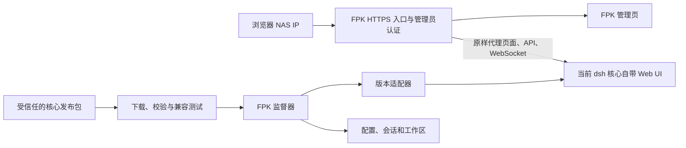

# FPK 与 dsh 核心解耦方案

## 目标与边界

FPK 固定提供 fnOS 管理员入口、NAS IP HTTPS 访问、fnOS 同源远程入口、更新管理、备份、进程监督、安全模式和回滚。dsh 核心独立安装和更新；每个核心版本自带与其匹配的官方 Web UI、服务端、插件依赖和 Linux 原生模块。FPK 不实现 dsh 的聊天、设置、会话或插件页面，也不直接调用这些页面背后的内部 API。

这样可以让 FPK 在不重装的情况下切换核心版本。无法保证任意未来 dsh 版本都可运行：上游可能更改启动参数、认证、Web 路由、数据格式，甚至取消当前 Web 入口。系统应保证不兼容更新被拒绝或回滚，已验证的旧核心和 FPK 管理入口仍可使用。

## 固定接口

FPK 只与**随核心版本发布的适配器**约定一个小接口：核心包路径、Node 版本和架构要求、启动与停止方式、就绪探测、浏览器登录引导、数据兼容范围及健康检查。适配器须声明自身接口版本；FPK 不认识的版本不得激活。发布清单使用 FPK 内置公钥验证签名，适配器和核心包再按清单校验摘要，之后才放入应用私有目录。

浏览器端继续使用同源入口。FPK 代理 dsh 自带的 HTML、静态资源、HTTP 和 WebSocket；FPK 的管理功能保留在 `/__fnos/`。不要把某个 dsh 版本的前端文件单独固化在 FPK 内，否则前后端 API 一变就会失配。

## 独立更新流程

1. 检查受信任发布源中的核心版本、适配器版本和签名发布清单。仅显示 npm 的最新版不足以证明 fnOS 兼容。
2. 下载到 `TRIM_PKGVAR/cores/.staging-*`，验证签名、摘要、平台与运行时完整性；至少检查 CLI、Web 页面、Node 原生模块及必要插件依赖。
3. 使用数据副本启动候选核心，验证就绪、登录令牌交换、设置页面、一次 HTTP 请求、WebSocket 和插件加载。测试失败则保留当前核心。
4. 入口进入维护状态，停止当前核心，创建升级前数据快照，再在真实数据上启动候选核心。通过健康检查后原子切换 `current` 指针并恢复入口，保留 `last-good`。
5. 首次启动失败时恢复升级前快照并重启 `last-good`。运行一段时间后发生故障则进入安全模式，由管理员决定是否恢复数据，避免自动覆盖升级后产生的新内容。

对存在不可逆数据迁移的版本，不做无人值守切换。需要可验证的迁移副本或明确的迁移策略。自动下载、自动安装和手动批准可作为独立策略选项，但都必须经过同一兼容检查。

## 当前实现需要调整的地方

当前实现已将随包 dsh 改为离线兜底核心，后续版本存入 `TRIM_PKGVAR/cores/`。管理员可配置可信 HTTPS npm 源，并独立安装版本；监督器会检查启动和 Web 登录，切换失败时恢复快照。FPK 使用 fnOS 应用商店的 `nodejs_v24`，不内置 Node。远程入口需要核心浏览器组件支持 `/app/dsh-fnos/dsh/` 前缀；安装器遇到不认识的上游代码时拒绝切换该核心。第三方插件还需要遵守相对路径约定。

以下仍是后续工作：

- 当前安装直接从管理员选定的 npm 源拉取包，并使用静态浏览器适配锚点。签名发布清单、独立适配器分发和更完整的插件兼容测试尚未实现。
- `supervisor.js` 已从核心目录的 `adapter.json` 读取 CLI 路径、参数和就绪标识，浏览器入口读取监督器生成的启动记录，不再自己解析 dsh 日志。当前 npm 安装器只会生成适用于已知 dsh Web 启动方式的适配记录；未来启动或认证方式变化仍需要发布新的适配记录与测试。
- 核心版本切换须继续在真实 fnOS 上验证 Node 原生模块、插件、设置和会话迁移；当前本地测试不能证明这些上游兼容性。

## 验收标准

同一 FPK 安装后，连续安装两个兼容 dsh 版本无需重装 FPK；旧会话与设置可用。故意提供损坏、架构错误、适配器版本未知或认证流程不匹配的核心包时，更新被拒绝，当前核心继续运行。首次启动失败可回滚；运行后故障进入可访问的安全模式。所有验证需在真实 fnOS 设备上完成。

## 依据

- [dsh 官方 Web UI 说明](https://github.com/deepseek-ai/deepseek-harness/blob/master/packages/bundle/web-app/README.md)
- [dsh 浏览器连接与认证说明](https://github.com/deepseek-ai/deepseek-harness/blob/master/packages/client/connection/README.md)
- [dsh 官方仓库：开发预览阶段的兼容性说明](https://github.com/deepseek-ai/deepseek-harness)
