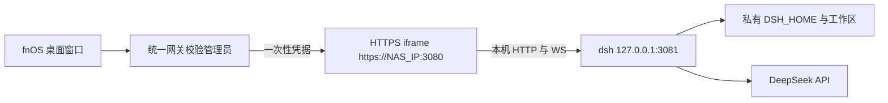

# fnOS 版 DeepSeek Harness 设计

## 目标

封装 DeepSeek 官方 `dsh web`：保留聊天、会话、模型设置、工具、插件和审批界面，不重写 Web UI。使用 FPK 安装，从 fnOS 桌面窗口打开；NAS IPv4 使用独立 HTTPS 端口，手机及主机名入口使用 fnOS 同源应用路径。目标平台为 fnOS x86_64、应用商店 `nodejs_v24`、fnOS 1.1.3100+。ARM 和多用户独立实例暂未验证。

## 访问结构

fnOS 桌面入口使用 `iframe` 窗口和统一网关，先验证 NAS 管理员登录态。网关返回窗口顶栏，提供独立的“应用设置”和“返回 dsh”按钮；下方嵌入 dsh 内容。应用签发一个 60 秒、一次使用的凭据供嵌入内容进入独立 HTTPS 端口。首次跨站导航凭该票据进入；HTTPS 入口换发 12 小时、可用于嵌入窗口的分区会话 cookie，再用 dsh 自带的启动令牌完成原生认证。dsh 原生登录 cookie 经过代理时改为 Secure、SameSite=None、Partitioned，以便在 fnOS 窗口中使用。登录重定向和已认证的两个顶栏导航可以跨站进入；常规请求和 WebSocket 仍接受同源检查。代理移除上游 `X-Frame-Options`。桌面会话设置只允许已验证 fnOS 来源嵌入的 `frame-ancestors`；由 fnOS 管理员入口签发的手机 WebView 会话不添加该限制，以兼容无法识别的移动端父页面来源。手机会话的 HTTPS 会话、一次性进入凭据和管理表单防伪仍生效。dsh 原始服务只监听 `127.0.0.1`。

手机、FN Connect 域名及其他非 IPv4 主机名改走 fnOS 的 `/app/dsh-fnos/dsh/` 应用路径。统一网关先校验管理员，再把该前缀下的 HTTP 与 WebSocket 请求转到本机 DSH；一次性票据通过此前缀进入。HTML 设置基址，核心浏览器组件的绝对 `/api` 和 `/plugins` 请求在安装时适配为前缀路径。第三方插件应使用相对 URL 或 `globalThis.__FNOS_GATEWAY_PREFIX__`；网关不能接管 fnOS 根路径。管理员认证也意味着外部服务直接调用的 webhook 无法借用此入口，后续如需开放，应按插件单独登记路径和认证规则。该同源模式使 DSH 浏览器插件与 FPK 设置页共享来源，因此插件必须被视为可信代码。WSL 冒烟测试覆盖页面及 JS 资源；点对点、公网和 FN Connect 下的实际 WebSocket、上传仍需实机验收。

FPK 运行时目录携带基础版本的 dsh 与 npm 依赖，独立更新的版本保存在 `TRIM_PKGVAR/cores`。Node 由 fnOS 应用商店提供。应用数据、会话、工作区和备份保存在 `TRIM_PKGVAR`。TLS 证书在首次启动时于 NAS 本机生成，私钥权限为 0600。浏览器初次访问会提示接受自签名证书；正式外网发布需要替换为可信证书和明确的网络边界。

## 运行维护与故障恢复

`supervisor.js` 启动 dsh 与 HTTPS 入口，记录核心版本和状态。管理页位于 `/__fnos/`，使用同一 fnOS 管理员入口、会话 cookie 与表单防伪凭据。dsh 处于安全模式或维护中时，入口拒绝代理请求，但管理页仍可打开。

应用启动时及之后每 24 小时查询管理员所选 npm 源中的 `@deepseek-ai/dsh` 正式版和预览版标签。管理员可指定版本并独立安装核心；更新必须通过当前浏览器适配补丁、原生模块与 Web 登录检查，失败时恢复旧核心。查询失败不影响 dsh 运行。自定义源必须使用 HTTPS；不会在失败时自动切换源。

备份包括 `dsh-home`、私有 `workspace` 和 fnOS 配置目录；不包含用户额外授予的 NAS 共享文件夹。每天 03:00 停止 dsh 后制作备份，再启动原核心。管理员也可手动执行。备份先写临时目录，完成后原子改名；分别保留 7 份每日、3 份手动、2 份升级前备份。升级脚本先停止服务并保存数据，新包首次启动发现 dsh 核心版本变化时再保存一次。备份位于同一 NAS 的应用私有目录，不能代替异机或异盘备份。

健康启动后保存当前应用运行时为 `last-good`。升级后新版核心首次启动失败时，自动回到 `last-good` 核心，但**不再自动恢复数据**：失败原因常与数据无关（健康检查抖动、端口被占、依赖冲突），而回滚会丢弃快照之后写入的会话与设置。此时管理页显示待确认横幅，由管理员选择恢复到操作前快照或保留当前数据；放弃回滚不会删除快照。该待确认状态持久化在 `state.json`，应用重启后仍然有效。插件安装、卸载与核心更新失败时同样处理。

健康检查 `probeWeb` 在判定失败前重试多次（5 次 × 2 秒）：一次慢响应不再等于核心已死，否则瞬时抖动会触发回滚。禁用和启用插件只改写配置档清单中的一个数组，失败时改回原值，不建立全量快照——一个开关不应占用升级回滚备份的保留名额。

回滚失败、首次安装启动失败、运行中意外退出或恢复后无法启动，都会进入安全模式。安全模式停止 dsh，禁止其命令和文件操作；管理员可在管理页恢复备份、重试或检查日志。显式恢复备份前需要二次确认，并自动把当前数据另存为一份手动备份（页面上显示其 ID），因此恢复操作本身可以退回。运行中意外退出不会自动恢复旧数据，以免覆盖故障前的新内容。

## dsh 适配点

当前上游 `dsh web` 拒绝监听 `0.0.0.0`，其浏览器设置页把非回环网址作为受限端，并且部分 Host API 只接受回环 Host。包装层让上游继续监听回环；经过 fnOS 管理员认证与同源检查后，反向代理将 Host/Origin 改写为回环地址。构建基础核心及独立安装新核心时，会检查 dsh 与浏览器连接组件的版本一致性，再寻找单一适配锚点；找不到时拒绝安装，避免静默兼容错误。

该适配将 dsh 原先的“只能在本机做设置”边界移到包装层的 NAS 管理员认证、一次性凭据、HTTPS cookie 与同源检查。fnOS 普通用户不会获得入口；一个安装实例仍对应一个管理员工作空间。dsh 的本机文件选择对话框和在 NAS 桌面打开文件等宿主交互能力，仍可能受无图形界面的 NAS 环境限制，需要实机检查。

## 文件与进程

- `fnos/cmd/main`：启动、停止、查询监督进程。
- `fnos/cmd/upgrade_init`：升级前停止服务并备份。
- `fnos/app/supervisor.js`：核心健康检查、备份调度、回滚、安全模式和更新检查。
- `fnos/app/core-manager.js`：独立核心安装、npm 源校验和版本选择。
- `fnos/app/ops.js`：私有目录备份、恢复和上一版运行时保存。
- `fnos/app/gateway.js`：fnOS 管理员引导、HTTPS 认证与 HTTP/WS 代理。
- `scripts/patch-dsh.mjs`：对固定上游版本的浏览器判断与根路径调用应用精确补丁。
- `TRIM_PKGVAR/dsh-home`：会话、模型设置和凭据。
- `TRIM_PKGVAR/workspace`：初始工作区。
- `TRIM_PKGVAR/dsh.log`：仅包用户可读，包含本次启动令牌。
- `TRIM_PKGVAR/backups`：自动、手动和升级前快照。
- `TRIM_PKGVAR/cores`：独立安装的 dsh 核心版本。

## 安全与权限

FPK 使用 `run-as=package`。dsh 具有运行命令和修改文件的能力，因此默认工作区留在私有目录，其他 NAS 文件夹由管理员显式授权。HTTPS 入口不向匿名请求返回 dsh 页面或 API；dsh 令牌不写入浏览器以外的公开响应。应用不在代理日志中记录请求路径或凭据。首次访问自签名证书需手动确认，不能把这种部署当作公网安全方案。

## 验收

1. 在干净的 fnOS x86_64 安装 FPK，应用商店 Node.js 24 依赖自动满足，应用可启停并回报状态。
2. 以 NAS IP 登录的管理员点击桌面图标后，能通过 HTTPS 打开 dsh，并完成模型密钥设置、工作区选择、会话、审批和 WebSocket 流式响应。
3. 普通用户及未持有会话 cookie 的局域网请求均无法访问 dsh；跨站写请求被拒绝。
4. NAS 的 `3081` 仅本机可访问；重启与升级后数据保留，旧进程和端口清理。
5. 用新装环境测试凭据更新、Web UI 静态文件加载、插件配置、文件操作和无 GUI 的宿主操作提示。
6. 在新版本首次启动失败时验证数据与核心回滚；模拟运行时崩溃，确认安全模式保留管理入口且阻断 dsh 代理。
7. 验证每日、手动和升级前备份可恢复设置、会话和私有工作区；确认版本检查失败时应用仍可运行。

## 参考

- [DeepSeek Harness 官方仓库](https://github.com/deepseek-ai/deepseek-harness)
- [官方 Web UI 说明](https://github.com/deepseek-ai/deepseek-harness/blob/master/packages/bundle/web-app/README.md)
- [fnOS Native 应用案例](https://github.com/ckcoding/fnnas-docs/blob/main/docs/examples/native.md)
- [fnOS 统一网关](https://github.com/ckcoding/fnnas-docs/blob/main/docs/core-concepts/gateway-registration.md)
